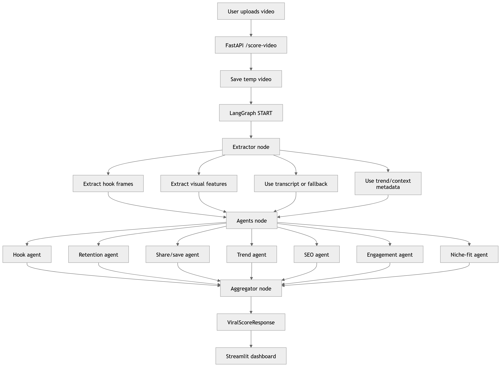

# Paracetamol_E2
Repository for our solution of E2 - ViralScore project of AI Cross Border Hackathon

## Project Architecture


## Yêu cầu
- Git
- Python >= 3.11
- uv (Python package manager)

Cài uv:
```bash
pip install uv
```

## Clone dự án
```bash
git clone https://github.com/SSalekin/Paracetamol_E2.git
cd Paracetamol_E2
```

## Cấu hình biến môi trường
Dự án đọc biến môi trường từ file `.env` (có thể đặt ở thư mục gốc repo).

Tạo `.env` từ file mẫu:

- Windows (PowerShell):
```powershell
Copy-Item env.example .env
```

- macOS/Linux:
```bash
cp env.example .env
```

Sau đó chỉnh các key trong `.env` (ví dụ `OPENAI_API_KEY`, hoặc các cấu hình LLM khác nếu bạn dùng).

## Cài dependencies
```bash
uv sync
```
Lệnh này sẽ tạo virtualenv tại `.venv` và cài dependencies.

## Setting up HEVC support on os
```bash
sudo apt update && sudo apt install -y ffmpeg libx265-dev x265 libavcodec-extra
```

The backend falls back to `ffmpeg` when OpenCV cannot decode HEVC/H.265 MP4 uploads.

## Whisper transcription
The backend transcribes uploaded video audio before scoring when no transcript is provided.

OpenAI Whisper (cấu hình qua biến môi trường hoặc `.env`):
```bash
OPENAI_API_KEY=... WHISPER_PROVIDER=openai WHISPER_MODEL=whisper-1 uv run uvicorn backend.app.main:app --host 0.0.0.0 --port 8000
```

Local Whisper is also supported if `faster-whisper` is installed:
```bash
WHISPER_PROVIDER=local LOCAL_WHISPER_MODEL=base uv run uvicorn backend.app.main:app --host 0.0.0.0 --port 8000
```

Use `WHISPER_PROVIDER=auto` to prefer OpenAI Whisper when `OPENAI_API_KEY` exists, otherwise try local `faster-whisper`.

## Agent intelligence
Specialist agents use the configured Seed model by default, then fall back to deterministic local heuristics if a model call fails.

For offline testing or faster local iteration:
```bash
AGENT_LLM_ENABLED=false uv run uvicorn backend.app.main:app --host 0.0.0.0 --port 8000
```

## Run backend
Chạy FastAPI tại `http://localhost:8000` (docs tại `http://localhost:8000/docs`).

- Windows (PowerShell):
```powershell
.\.venv\Scripts\python.exe -m uvicorn backend.app.main:app --host 0.0.0.0 --port 8000
```

- macOS/Linux:
```bash
uv run uvicorn backend.app.main:app --host 0.0.0.0 --port 8000
```

## Run frontend
Chạy Streamlit tại `http://localhost:8501`.

- Windows (PowerShell):
```powershell
$env:API_URL="http://localhost:8000"
.\.venv\Scripts\python.exe -m streamlit run frontend/app.py --server.port 8501 --server.address 0.0.0.0
```

- macOS/Linux:
```bash
API_URL=http://localhost:8000 uv run streamlit run frontend/app.py --server.port 8501 --server.address 0.0.0.0
```
